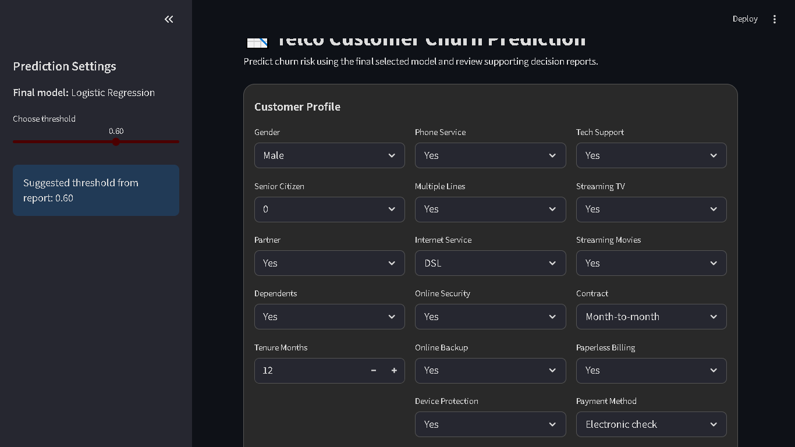
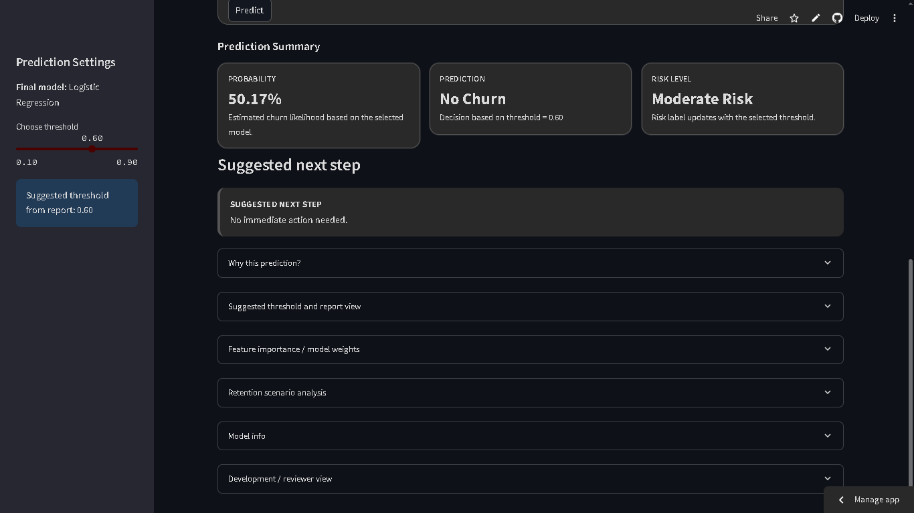
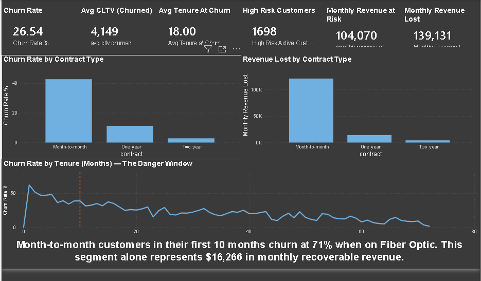
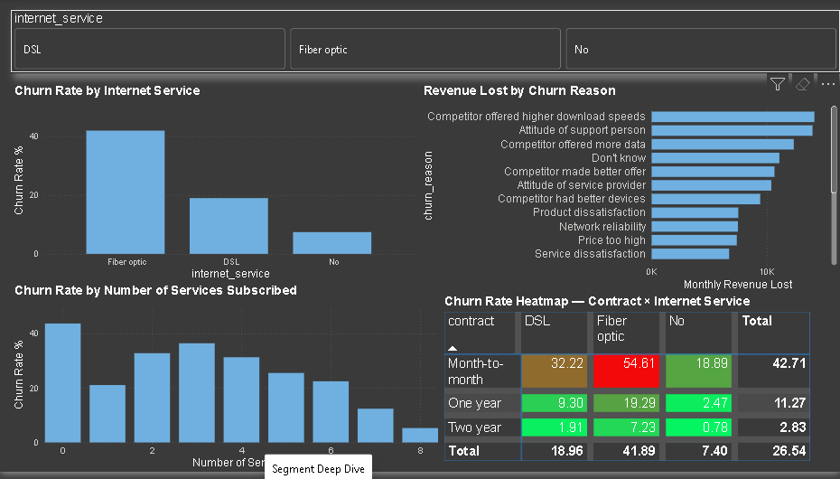
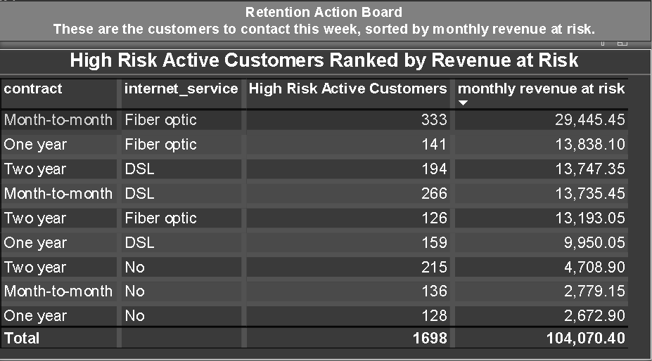

# $49,302: A Telco Churn Analysis That Ends With a Number

`SQL` · `PostgreSQL` · `Power BI` · `DAX` · `Python` · `Scikit-learn` · `Streamlit` · `SHAP`

**Live App → [Open in Streamlit](https://end-to-end-customer-churn-prediction-retention-decision-system.streamlit.app/)**

---

Most churn projects answer one question, will this customer leave, and stop there. That answer alone does not help a business team. They need to know who to call, why those people are leaving, and how much revenue they are protecting by acting on it.

So this project has two layers. A machine learning system that predicts churn. And a business intelligence layer built in SQL and Power BI that turns those predictions into decisions, the way an analyst at a telecom company would actually do it.

---

## ML Prediction App

<p align="center">
  
  
</p>

---

## Power BI Dashboard

### Page 1 — Executive Dashboard

<p align="center">
  
</p>

Six KPI cards. Churn rate, average CLTV of churned customers, average tenure at churn, high risk customer count, monthly revenue at risk, monthly revenue lost. Two bar charts comparing churn rate and revenue lost side by side by contract type. A tenure line chart with a danger window marker showing where churn peaks. One key finding line at the bottom for any stakeholder with 30 seconds.

### Page 2 — Segment Deep Dive

<p align="center">
  
</p>

Churn rate by internet service. Revenue lost by churn reason ordered by revenue impact. Churn rate by number of services subscribed showing product stickiness. A contract × internet service heatmap where Month-to-month Fiber optic lights up red at 54.61%, the highest risk intersection in the entire dataset. Internet service slicer at the top makes every visual interactive.

### Page 3 — Retention Action Board

<p align="center">
  
</p>

High risk active customers ranked by monthly revenue at risk. Month-to-month Fiber optic sits at the top with 333 customers and $29,445 at risk. Total row confirms 1,698 customers and $104,070 in monthly revenue that can still be protected. This is the page the retention team opens Monday morning.

**The Power BI dashboard file (`churn_dashboard.pbit`) is included under `analytics/power_bi/` for review.**

---

## What this demonstrates

- Full ML pipeline from raw data to deployed prediction app
- Data cleaning independently in both Python (ML pipeline) and SQL (analytics layer)
- Leakage prevention: churn_reason, churn_score, and CLTV excluded from the model with documented reasoning
- Model comparison with threshold optimization, not fixed at 0.5
- Explainability using SHAP to connect model output to business decisions
- SQL analytics in PostgreSQL: window functions, CTEs, cohort analysis, revenue segmentation
- Business dashboarding in Power BI with DAX measures and live PostgreSQL connection
- Written business recommendations with actual revenue numbers attached

---

## ML System

### Model comparison

Both Logistic Regression and XGBoost were built and evaluated.

| Metric | Logistic Regression | XGBoost |
|---|---|---|
| ROC-AUC | 0.85 | 0.86 |
| Recall (churn class) | 0.72 | 0.42 |
| Precision (churn class) | 0.56 | 0.74 |
| Accuracy | 0.78 | 0.81 |
| F1 Score | 0.63 | 0.53 |

XGBoost has higher accuracy and precision. Logistic Regression has significantly higher recall, it catches more churners. In a retention context missing a churner costs more than a false alarm. A customer incorrectly flagged wastes one outreach call. A churner missed walks out the door. Logistic Regression was chosen for the final app because of this recall advantage and because its predictions are explainable to a business team.

### Threshold optimization

The decision threshold is configurable in the app, not fixed at 0.5. The cost of missing a churner is not the same as the cost of a false alarm. At threshold 0.3 recall reaches 0.91. At threshold 0.6 precision reaches 0.56. The right threshold depends on the business goal, not the textbook default.

| Threshold | Precision | Recall | Customers Flagged |
|---|---|---|---|
| 0.3 | 0.44 | 0.91 | 782 |
| 0.4 | 0.48 | 0.87 | 681 |
| 0.5 | 0.52 | 0.80 | 574 |
| 0.6 | 0.56 | 0.72 | 480 |

### Why certain columns were excluded from the model

**churn_reason**: exists only after a customer has already churned. Using it would be direct data leakage. It is used in the SQL analytics layer instead, where it belongs.

**churn_score**: generated by an external churn model. Using it means the model learns from another model's output, not from genuine customer behavior.

**CLTV**: calculated using churn-related assumptions. Including it contaminates the feature space.

These exclusions are deliberate, not oversights.

---

## Analytics Layer: What the SQL found

Nine SQL files against a PostgreSQL database. Every finding is attached to a revenue number.

**The churn rate is 26.5% against a telecom industry benchmark of under 10%.** That gap is $139,130 in recurring monthly revenue gone every single month.

**Month-to-month customers are 48% of the customer base but responsible for 87% of revenue lost.** The gap between their customer share and their revenue loss share is where the retention budget needs to go.

**46% of all revenue loss comes from customers in their first 10 months.** Churn drops consistently after month 30. The retention effort needs to be front-loaded into year one.

**Month-to-month + Fiber optic + tenure under 10 months = 71% churn rate.** 238 active customers sit in this combination right now. Of those, 204 have no online security add-on and represent $16,266 in recoverable monthly revenue. One $10 per month add-on reduces their churn risk from 65% to 8%.

**$73,704 every month was lost to internal failures**, bad support attitudes, network reliability issues, pricing gaps. That is 48% more than competitor-driven losses. The data says fix your own house before worrying about the competition.

At a conservative 20% retention success rate across five priority segments, the recoverable monthly revenue is **$49,302.**

### Why PostgreSQL and not SQLite

PostgreSQL supports direct Power BI integration via live connection, handles concurrent access, and has stronger query optimization for analytical workloads. SQLite is a single-file embedded database, suitable for development, not for a BI tool connection or multi-user access.

---

## Project Structure

```
End-to-End-Customer-Churn-Prediction-Retention-Decision-System/
├── app/
│   └── streamlit_app.py
├── src/
│   ├── cleaning.py
│   ├── config.py
│   ├── data_loader.py
│   ├── preprocessing.py
│   ├── features.py
│   ├── models.py
│   ├── evaluation.py
│   ├── predict.py
│   └── run_pipeline.py
├── analytics/
│   ├── sql/
│   │   ├── 01_setup.sql
│   │   ├── 02_cleaning.sql
│   │   ├── 03_kpis.sql
│   │   ├── 04_contract.sql
│   │   ├── 05_tenure.sql
│   │   ├── 06_services.sql
│   │   ├── 07_intersection.sql
│   │   ├── 08_churn_reason.sql
│   │   └── 09_retention_roi.sql
│   ├── power_bi/
│   │   └── churn_dashboard.pbit
│   └── insights/
│       ├── findings_summary.md
│       └── retention_brief.md
├── notebook/
│   ├── project_notebook.ipynb
│   └── Telco_churn_project.ipynb
├── artifacts/
│   ├── feature_defaults.json
│   └── feature_schema.json
├── models/
│   ├── logistic_telco_model.pkl
│   └── xgb_telco_model.pkl
├── reports/
│   ├── feature_importance_logistic.csv
│   ├── feature_importance_xgboost.csv
│   ├── metrics.json
│   ├── model_comparison.csv
│   ├── retention_policy_table.csv
│   ├── retention_scenarios.csv
│   └── threshold_metrics.csv
├── data/
│   ├── telco_churn.csv
│   └── telco_churn.xlsx
├── data_processed/
│   └── final_dataset.parquet
├── screenshots/
├── App_Videos/
│   └── app-recording.webm
├── requirements.txt
└── README.md
```

---

## Running locally

```bash
pip install -r requirements.txt
python -m src.run_pipeline
streamlit run app/streamlit_app.py
```

For the analytics layer, run the `.sql` files in `analytics/sql/` in order against a PostgreSQL database loaded with the Telco dataset. Open `analytics/power_bi/churn_dashboard.pbit` in Power BI Desktop and connect to the same database.

---

## Tech stack

**ML system:** Python · Scikit-learn · XGBoost · Pandas · Streamlit · SHAP

**Analytics layer:** PostgreSQL · SQL · Power BI · DAX

---

If you want to walk through the findings or the reasoning behind any decision in this project, I can explain every number.

**Nihar Nandala**
[GitHub](https://github.com/niharnandala) · [LinkedIn](https://linkedin.com/in/niharnandala)